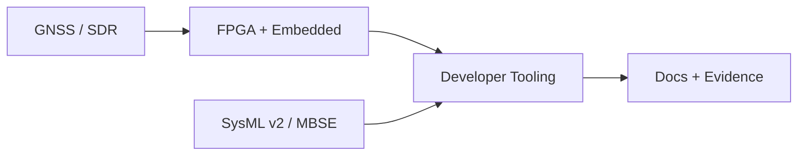

# Mathew Cosgrove

  
  
  
  
  
  

I build tools and systems around GNSS software-defined receivers, FPGA/embedded
signal processing, MBSE workflows, and engineering automation.

My public GitHub work focuses on reusable lab environments, developer tooling,
documentation-first workflows, and experiments that make complex engineering
systems easier to set up, inspect, and maintain. Some of my professional work is
not represented directly on public GitHub, so this profile emphasizes public
tooling, lab kits, and reusable engineering workflows.

## Current focus

- GNSS software-defined receiver architecture and test infrastructure
- FPGA/embedded signal-processing workflows
- SysML v2 / MBSE local tooling and model-management experiments
- Developer tooling for reproducible engineering workflows
- Agent-assisted planning, documentation, and repository maintenance

## Featured public work

| Project | Focus |
| --- | --- |
| [`mbse-lab`](https://github.com/cosgroma/mbse-lab) | Local SysML v2 lab kit for Flexo MMS, SysON, bridge workflows, diagnostics, documentation, and safe model-workspace boundaries. |
| [`docker-stacks`](https://github.com/cosgroma/docker-stacks) | Reusable Docker environment experiments. |
| [`dotfiles`](https://github.com/cosgroma/dotfiles) | Development environment configuration and workflow setup. |
| [`database-tools`](https://github.com/cosgroma/database-tools) | Structured-data and automation tooling experiments. |

## Systems I like building

## How I work

I care about reproducible setup, clear CLI contracts, practical test coverage,
safe sharing boundaries, and documentation that helps both developers and
technical leads understand what a repository is for.

A good repository should make it obvious:

- what problem it solves,
- how to run it locally,
- what is safe to share,
- what is experimental,
- and where future work belongs.

## Engineering themes

`gnss` · `sdr` · `fpga` · `embedded-systems` · `sysml-v2` · `mbse` ·
`python` · `developer-tools` · `documentation` · `automation`

## GitHub activity

These cards use public GitHub profile data. For a more complete picture of
private and cross-repository work, I prefer self-generated SVGs through GitHub
Actions, such as [`jstrieb/github-stats`](https://github.com/jstrieb/github-stats)
or [`github-profile-summary-cards`](https://github.com/vn7n24fzkq/github-profile-summary-cards).

  
  

<!--
Recommended generated-stats option 1: jstrieb/github-stats

After setting up a separate `cosgroma/github-stats` repository from:
https://github.com/jstrieb/github-stats

replace the public cards above with:

  
  
  
  

Recommended generated-stats option 2: github-profile-summary-cards

After configuring:
https://github.com/vn7n24fzkq/github-profile-summary-cards

you can replace the public cards above with generated local SVGs:

  
  
  

Privacy note:
If a generator uses a personal access token with private-repository access,
configure exclusions before publishing generated SVGs. Exclude private project
names, sensitive repositories, and languages or activity summaries that could
misrepresent or disclose work that should remain private.
-->

Optional contribution visualization

This section is intentionally collapsed. I like keeping animated or decorative
GitHub visuals secondary to the main technical profile.

<!--
Option A: 3D contribution calendar
Set up:
https://github.com/yoshi389111/github-profile-3d-contrib

Then uncomment one generated image:

-->

<!--
Option B: contribution snake
Set up:
https://github.com/Platane/snk

Then uncomment:

  <picture>
    <source media="(prefers-color-scheme: dark)" srcset="https://raw.githubusercontent.com/cosgroma/cosgroma/output/github-contribution-grid-snake-dark.svg">
    <source media="(prefers-color-scheme: light)" srcset="https://raw.githubusercontent.com/cosgroma/cosgroma/output/github-contribution-grid-snake.svg">
    
  </picture>

-->

## Contact

- GitHub: [@cosgroma](https://github.com/cosgroma)
- Email: cosgroma@gmail.com
